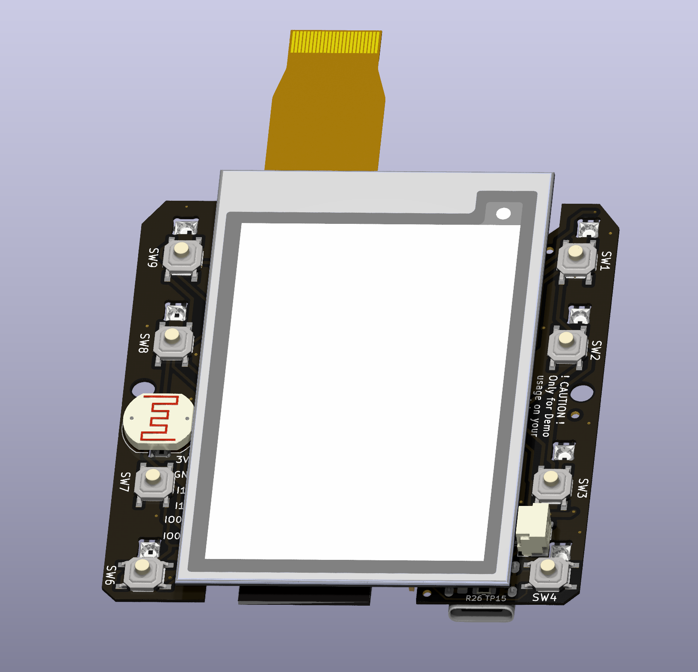
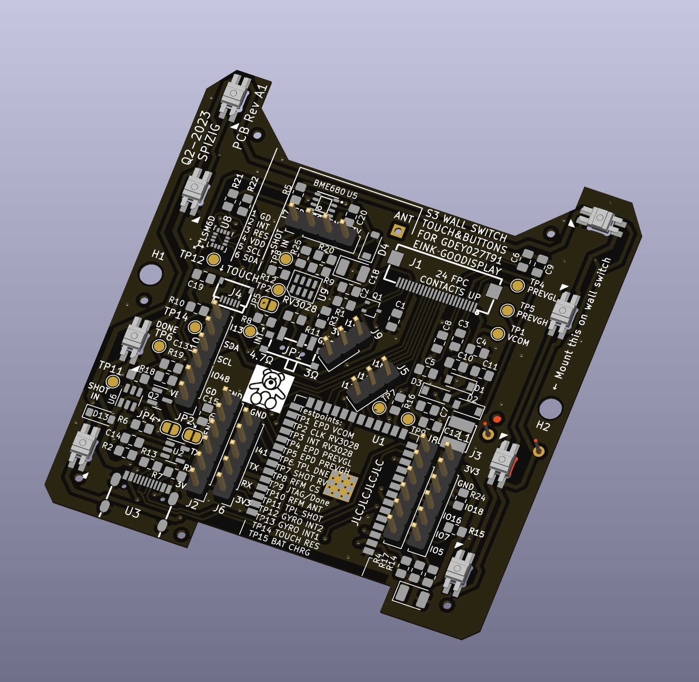

A WallSwitch with a clever EINK Display that measures your Air Quality, measures Temperature, detects movement, measures Light Conditions... and many more.
And the Best of all: "It can be your own LOCAL Voice Assistant or MediaPlayer"

This Device perfectly integrates in your Smart Home (e.g. HomeAssistant or IO Broker).  
No permanent backlight On Display that disturbs your sleep. Just a brillant E-Ink Display with outstanding contrast and some Buttons that you can feel when you swipe over with your plam.
A lightweight Design with a perfect WAF Factor. Fits on your Desktop or on your wall. 
The device can be programmed, adapted, hacked, tinkered and individualised by YOU.
You want to push boundries even further: Use Arduino and do a deep Dive in Ultra Low Power Mode. The Battery might run for Years with an intelligent Power Gateing.

Eight Ambient Light LEDs can give you a visuel quick feedback if needed:

What is under the hood:
Main thing you see when you have a first look is the massive 2.7 " E-Ink Screen

Hardware Specs:
- 2.7" EInk Epaper with or without Touch Screen... other screens might work as well
- ESP32 S3 Dual Core Microcontroller with USB OTG, Wifi & BT, Mass Storage Mode. 
- 8 X SK6812 Mini RBG LEDs
- 8 X Hardware Buttons...REAL BUTTONS with clicks: No Touch Buttons that might not work if you have wet or dirty fingers
- BOSCH BME680 for eCo2, Temperature, Humidity and Pressure Measurements
- ST LSM6DSL Ultra Low Noise MEMS Gyro + Accel for Movement Detection and Earthquake Detection
- INMP441 MEMS Microphone for Voice Assistant
- Socket for MAX98357A I2S Class D Amplifier for Audio Output for Media Player
- LDR Ambient Light Sensor: Detect the Ambient Light conditions in your room.
- RTC1: TPL5110 for PowerGateing and low Standby Current
- RTC2 Option: RV3028 C7 for Ultra Low RTC with Backup Cap lasts 3h
- Optional: RFM95 LoRa Radio for Desaster Radio (Limitations: May not work together with Microphone)
- Connector for KNX EIB Smart Home with Nano BCU
- Connector for Your Own Ideas... Several free GPIOs
- Switch for adapting to Waveshare/Gooddisplay EINK Display
- All SMD components have a size 0603 or larger to enable easier soldering/Tinkering.

Underneath the EINK Screen is a placeholder for an optional RFM95/RFM98 Long Range Communication Module. This Module works with LoRa, FSK or other wireless standards. 
Up 15km Range of communication can be established with this module. Perfect as well for decoding your Bresser Weather Station and translate it to MQTT for your Smart Home.

The other side of the PCB looks like this:

If you scroll further down you may see a picture of the TOP View of the PCB
On the Top side of the PCB you see the Main Processor: This is an ESP32-S3 and various sensors:
- Ultra Low Power RTC RV3028 [U9] for Low Power Battery Operation wakeup
- Ultra Low Noise MEMS LSM6DSL [U8] 6 Axis GYRO+ACCEL + Tap Detection
- Ultra Low Power Gateing Chip TPL5110: [U6]
- Bosch BME680 for Air Quality Measurements [U5]
- EInk Screen connector 
- Touch Screen connector [JP5]
- Space for the oprional INMP441 Microphone [J5], [J9]
- 8 RGB LEDs which can be adressed individually. Perfect for Quizshow effects. Ideal for Audiovisual feeddback
- 9 Click Buttons. [SW1-SW9] - SW5 is hidden under the screen and can be used as Physical Click Button
- Space for Several Connectors[J2, J8, J3] to plugin even more modules like Audio Module for an Media Player or Voice Assistant Feedback.

And another view with all the SMD Parts simulated:

What is currently working:

Hardware:
- Currently the HW BringUp is about to finish.
- The basic Hardware is up and running stable.
- Eink, Microphone, LEDs, Buttons, BME680. LSM6 Gyro work well.

The optional Modules are  still under test
  -   TP4065 Lipo Battery Charger Circuit
  -   Battery Switchover Circuit once Battery is fully charged to avoid Battery damage due to overcharging
  -   TPL5110 Low Power RTC Module
  -   RV3028 Low Power Module
  -   Long Range Communication Module RF Module RFM95
  -   230V Power Converter to 5V/3.3V for Wall Mode.
  

Software Sketches working:
Arduino:
  - Flashing the Device over USB with you Chrome Web Browser: https://web.esphome.io/
  - Logging over USB USBSerial
  - EInk Basic Update of content
  - EInk Partial Update Dynamic Update of content
  - Read out BME680 Data (Temp, Humidity, Pressure, eCO2, IAQ,...)
  - Microfone: Calculate loudness in dBA
  - Audio Player: Playback MP3, TTS via Google and Webradio
  - 8 Buttons can be detected.
  - 8 RGB LEDS whcih can be adressed individually
  - LSM6 Gyro: Read out of Basic Values Roll, Pitch, Yaw
  - All typical 24pin EInk Displays which are mentioned on GxEPD2: https://github.com/ZinggJM/GxEPD2/tree/master
  - Flashing & Logging the Device over 2.54mm Socket with a dedicated Flash Adapter

 Home Assistant with ESPHome Integration:
   - Flashing the Device over USB with you Chrome Web Browser: https://web.esphome.io/
   - Logging over USB with ESP Home
   - Display Messages on EInk Display
   - Voice Assistant: Switch on Light,.... you name it
   - Media Player: Playback of TTS Messages, Audio Files,Web Radio
   - Keyboard: 8 Buttons are detected individulally
   - RGB LED Control SK6812 Mini
   - Flashing & Logging the Device over 2.54mm Socket with a dedicated Flash Adapter
     
Known ESPHome Issues right now:
  - Voice Assistant has some issues if used together with Media Player. Leads to Stuttering Audio once Media Playback is started.
  - No LSM GYRO integration
  - 2 GPIOS used to much due to Keypad component of ESPhome only supports 4x4 Matrix Keyboards
  - GPIO8 can not be used for Keyboard Fake Keys.

Known Issues on Arduino:
  - LSM6 Gyro has some issues with BME680 BSEC: Leads to constant output of 500 ppm

What is planned:
- EInk Touch Screen 2.7 'integration of Good Display https://www.good-display.com/product/259.html
- A Touch screen https://www.good-display.com/product/259.html
- Read out data of a Weather Station Bresser 6in1 We<ther Station and forward to MQTT with an RFM95 Chip.
- LDR for Light Detection. Monitoring of Enviroment Data
- Ultra Low Power RTC RV3028 for Low Power Battery Operation wakeup
- Ultra Low Noise MEMS LSM6DSL GYRO+ACCEL for Earthquake Detection-> https://github.com/biagiom/QuakeSense
- Ultra Low Noise MEMS LSM6DSL for movement detection and Tap Detection
- Ultra Low Power Mode TPL5110: Let the Processor sleep with TPL5110 Power Gateing and shut down all that is battery draining.
- Bosch BME680 for Air Quality Measurements
- 9 physical buttons for moments where you do not wnat to use a touchscreen
- KNX Integraion with Nano BCU
- LORA:
  - Transmit Air Quality Data on a regular Basis (every 15min)
  - Transmit Data when Air Quality changes dramatically
  - Transmit Data when Air Quality changes dramatically
  - Recieve Commands to Switch on / off ext Relay
  - Switch to Desaster Mode and search for BLE Heart Rate Devices nearby and sent this data via LoRa

WARNINGS
This is my hobby. Please do NOT be a DIRTY COPY CAT and make your own comercial product out of it.
See License before you copy anything out of it.
 
If you use this Hardware, Software, Code or schematics you agree that any harm, damage, burn or injuries are YOUR RESPONSIBILITY! 
The Author may not be held liable for any damage that might happen if you try this code out or use this product or parts of it.
Legal validity of this disclaimer: This disclaimer is to be regarded as part of the internet publication which you were referred from. 
If sections or individual terms of this statement are not legal or correct, the content or validity of the other parts remain uninfluenced by this fact.

Referrals and links The author is not responsible for any contents linked or referred to from his pages - unless he has full knowledge of illegal contents and would be able to prevent the visitors of his site from viewing those pages. If any damage occurs by the use of information presented there, the author might not be liable. Furthermore the author is not liable for any postings or messages published by users of discussion boards, guest books or mailing lists provided.

Arduino:
Before you compile please ensure you modify all your credentials and used sensors in "credentials.h" which have been marked REPLACEMEUSER
This Source Code is provided "AS it is" . 
Also ensure you have installed the following libs:
Code Sources that influenced this Source Code and which libaries you may need:

https://github.com/knolleary/pubsubclient/blob/master/examples/mqtt_auth/mqtt_auth.ino
https://randomnerdtutorials.com/esp32-mqtt-publish-subscribe-arduino-ide/
RGBW for SK6812:
Original code by Jim Bumgardner (http://krazydad.com).
Modified by David Madison (http://partsnotincluded.com).
Extended by Christoph Wempe
https://gist.github.com/CWempe?direction=desc&sort=created

Adafruit BME/BMP280/SGP30 sketches/libs
Please consider buying their products due to their great work in Arduino libs
https://github.com/adafruit/Adafruit_SGP30
https://github.com/adafruit/Adafruit_BMP280_Library

Bosch BME680 BSEC Lib
https://github.com/BoschSensortec/BSEC-Arduino-library

Andreas Spiess
OTA Sketch for OTA Update of the ESP32 over Wifi
https://github.com/SensorsIot/ESP32-OTA

Knolleary pubsubclient
/pubsubclient/blob/master/examples/mqtt_auth/mqtt_auth
https://github.com/knolleary/pubsubclient

Fastled
https://github.com/FastLED/FastLED

Settings for Jumpers & Solder Bridges:
Jumper:
- JP2 = This MUST BE OPEN! if USB Connected & 3.3V Prog
- JP3 = GYRO INT Emergency CUT: If you want no more Interupts from the Gyro.
- JP4 = MAINS Mode / No TPL5110 Mode. Disable the RTC for Power Gateing. Use for permanent connection to USB
- JP5 = RV3028 INT CUT for RFM95 OP. Must be cut if an RFM Long Range RF Mode is installed
- JP6 = Switch of Input Power Supply Voltage
- JP5 = Solder for RFM95 OP & Cut JP5

I²C Address of onboard Devices.
- 0x52 RV3028
- 0x6A LSM6DSL
- 0x77 BME680

Testpoints for soldering and Tinkering:
TP1 EPD VCOM -> Debuging of EINK
TP2 CLK RV3028 
TP3 INT RV3028
TP4 EPD PREVGL -> Debuging of EINK
TP5 EPD PREVGH -> Debuging of EINK
TP6 TPL DNE -> Debuging of EINK... Connect to a GPIO for Ulatra Low Power sleep and fire a 1 whenever you want to Deep Sleep on that GPIO
TP7 SHOT RV3028 -> Wakeup Pin for RTC2
TP8 RFM CS -> Soldering Pin needed for RFM95
TP9 JTAG/Done
TP10 RFM ANT -> Connector for 868 MHZ Antenna
TP11 TPL SHOT -> Wakeup Pin for TPL 5110 RTC
TP12 GYRO INT2
TP13 GYRO INT1
TP14 TOUCH RES -> Touch Controller Reset Pin. Hopefully never needed
TP15 BAT CHRG -> Battery charg Pin. Hopefully never needed.

Known HW Limitations:

TODO:
- RV_3028 INT ist connected with LORA RFM MISO. No paralell usage possible
- INMP441 Mic ist connected with LORA RFM95. No paralell usage possible
- USB ESD Diodes missing
- SK6812 is an input of KNX connector at the same time?
- Rerouting of SK6812 necesssary. Not possible to  GPIO 0... otherwise board will not start.
- Done Pin TPL5110 not routed to ESP32 IO3. No Power Shutdown without a Solder Bridge
- 

