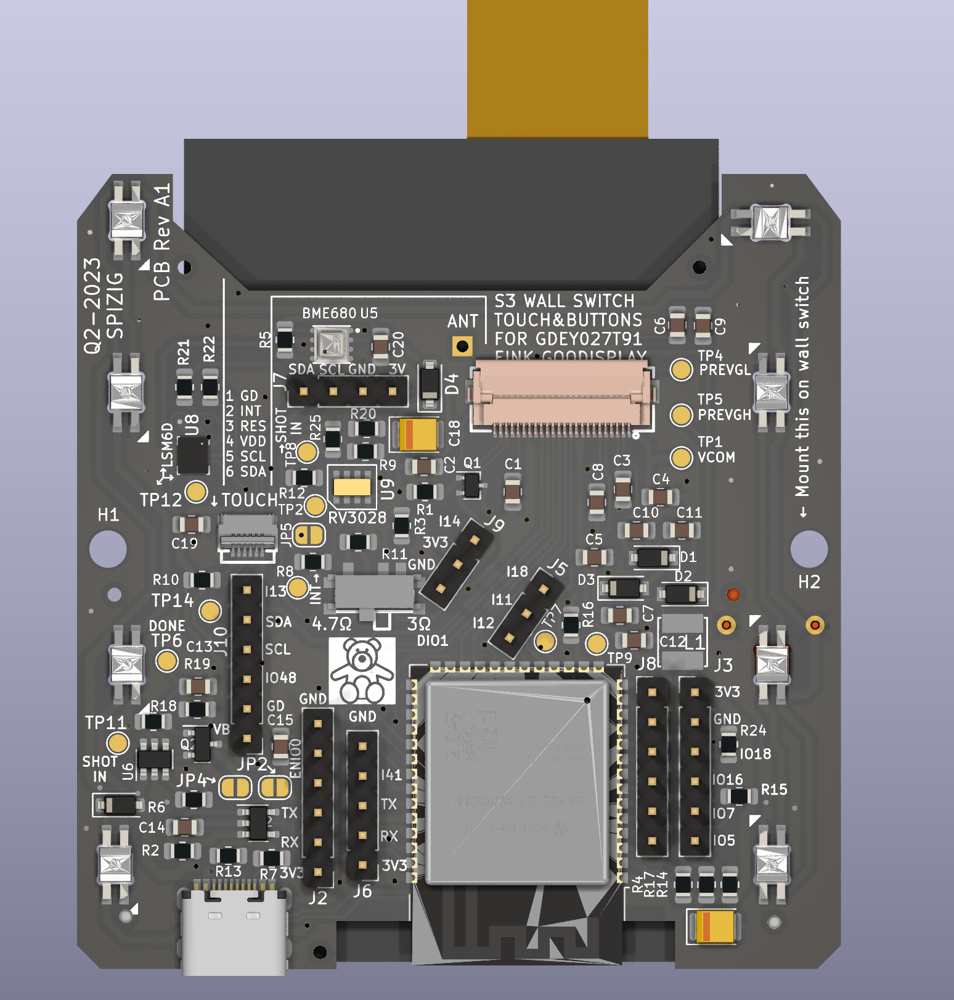

An AirQuality EInk WallSwitch that measures your Air Quality, measures Temperature, detects movement, measures Light Conditions... and many more.
And the Best of all: "It can be your own LOCAL Voice Assistant or MediaPlayer"

This Device perfectly integrates with you Smart Home HomeAssistant or IO Broker. 
The device can be programmed, adapted and indiviudalised by YOU.
Your want to push boundries even further: Use Arduino and do a deep Dive in Ultra low Power Mode. The Battery might run for Years with an intelligent Power Gateing.

Close Up View

What is under the hood:
Main thing you see when you have a first look is the massive 2.7 " E-Ink Screen

Please see https://hackaday.io/project/189884-airqearthq-lora-eink-wallswitch for further details

Underneath the EINK Screen is a placeholder for an optional Long Range Communication Module. This Module works with LoRa, FSK or other wireless standards. 
Up 15km Range of communication can be established with this module. 

On the PCB side you see the Main Processor an ESP32-S3 and various sensors:
- Ultra Low Power RTC RV3028 for Low Power Battery Operation wakeup
- Ultra Low Noise MEMS LSM6DSL GYRO+ACCEL 
- Ultra Low Power Gateing Chip TPL5110: 
- Bosch BME680 for Air Quality Measurements
- EInk Touch Screen 2.7" incl connector
- Space for the oprional INMP441 Microphone
- 8 RGB LEDs which can be adressed individually. Perfect for Quizshow effects. Ideal for Audiovisual feeddback
- Space for Several Connectors to plugin even more modules like Audio Module for an Media Player or Voice Assistant Feedback.

And another view without all the SMD Parts soldered:

What is currently working:

Hardware:
- Currently the HW BringUp is about to finish.
- The basic Hardware is up and running stable.
- Eink, Microphone, LEDs, Buttons, BME680. LSM6 Gyro work well.

The optional Modules are  still under test
  -   TP4065 Lipo Batterry Charger Circuit
  -   Battery Switchover Circuit for WallMode
  -   TPL5110 Low Power RTC Module
  -   RV3028 Low Power Module
  -   RF Module RFM95
  -   230V Power Converter for Wall Mode.
  

Software Sketches working:
Arduino:
  - Flashing the Device over USB with you Chrome Web Browser: https://web.esphome.io/
  - Logging over USB USBSerial
  - EInk Basic Update of content
  - EInk Partial Update Dynamic Update of content
  - Read out BME680 Data (Temp, Humidity, Pressure, eCO2, IAQ,...)
  - Microfone: Calculate loudness in dBA
  - Audio Player: Playback MP3, TTS via Google and Webradio
  - 8 Buttons can be detected.
  - 8 RGB LEDS whcih can be adressed individually
  - LSM6 Gyro: Read out of Basic Values Roll, Pitch, Yaw
  - All typical 24pin EInk Displays which are mentioned on GxEPD2: https://github.com/ZinggJM/GxEPD2/tree/master
  - Flashing & Logging the Device over 2.54mm Socket with a dedicated Flash Adapter

 Home Assistant with ESPHome Integration:
   - Flashing the Device over USB with you Chrome Web Browser: https://web.esphome.io/
   - Logging over USB with ESP Home
   - Display Messages on EInk Display
   - Voice Assistant: Switch on Light,.... you name it
   - Media Player: Playback of TTS Messages, Audio Files,Web Radio
   - Keyboard: 8 Buttons are detected individulally
   - RGB LED Control SK6812 Mini
   - Flashing & Logging the Device over 2.54mm Socket with a dedicated Flash Adapter
     
Known ESPHome Issues right now:
  - Voice Assistant has some issues if used together with Media Player. Leads to Stuttering Audio once Media Playback is started.
  - No LSM GYRO integration
  - 2 GPIOS used to much due to Keypad component of ESPhome only supports 4x4 Matrix Keyboards
  - GPIO8 can not be used for Keyboard Fake Keys.

Known Issues on Arduino:
  - LSM6 Gyro has some issues with BME680 BSEC: Leads to constant output of 500 ppm

What is planned:
- EInk Touch Screen 2.7 'integration of Good Display https://www.good-display.com/product/259.html
- A Touch screen https://www.good-display.com/product/259.html
- Read out data of a Weather Station Bresser 6in1 We<ther Station and forward to MQTT with an RFM95 Chip.
- LDR for Light Detection. Monitoring of Enviroment Data
- Ultra Low Power RTC RV3028 for Low Power Battery Operation wakeup
- Ultra Low Noise MEMS LSM6DSL GYRO+ACCEL for Earthquake Detection-> https://github.com/biagiom/QuakeSense
- Ultra Low Noise MEMS LSM6DSL for movement detection and Tap Detection
- Ultra Low Power Mode TPL5110: Let the Processor sleep with TPL5110 Power Gateing and shut down all that is battery draining.
- Bosch BME680 for Air Quality Measurements
- 9 physical buttons for moments where you do not wnat to use a touchscreen
- KNX Integraion with Nano BCU
- LORA:
  - Transmit Air Quality Data on a regular Basis (every 15min)
  - Transmit Data when Air Quality changes dramatically
  - Transmit Data when Air Quality changes dramatically
  - Recieve Commands to Switch on / off ext Relay
  - Switch to Desaster Mode and search for BLE Heart Rate Devices nearby and sent this data via LoRa

WARNINGS
This is my hobby. Please do NOT be a DIRTY COPY CAT and make your own comercial product out of it.
See License before you copy anything out of it.
 
If you use this Hardware, Software, Code or schematics you agree that any harm, damage, burn or injuries are YOUR RESPONSIBILITY! 
The Author may not be held liable for any damage that might happen if you try this code out or use this product or parts of it.
Legal validity of this disclaimer: This disclaimer is to be regarded as part of the internet publication which you were referred from. 
If sections or individual terms of this statement are not legal or correct, the content or validity of the other parts remain uninfluenced by this fact.

Referrals and links The author is not responsible for any contents linked or referred to from his pages - unless he has full knowledge of illegal contents and would be able to prevent the visitors of his site from viewing those pages. If any damage occurs by the use of information presented there, the author might not be liable. Furthermore the author is not liable for any postings or messages published by users of discussion boards, guest books or mailing lists provided.

Arduino:
Before you compile please ensure you modify all your credentials and used sensors in "credentials.h" which have been marked REPLACEMEUSER
This Source Code is provided "AS it is" . 
Also ensure you have installed the following libs:
Code Sources that influenced this Source Code and which libaries you may need:

https://github.com/knolleary/pubsubclient/blob/master/examples/mqtt_auth/mqtt_auth.ino
https://randomnerdtutorials.com/esp32-mqtt-publish-subscribe-arduino-ide/
RGBW for SK6812:
Original code by Jim Bumgardner (http://krazydad.com).
Modified by David Madison (http://partsnotincluded.com).
Extended by Christoph Wempe
https://gist.github.com/CWempe?direction=desc&sort=created

Adafruit BME/BMP280/SGP30 sketches/libs
Please consider buying their products due to their great work in Arduino libs
https://github.com/adafruit/Adafruit_SGP30
https://github.com/adafruit/Adafruit_BMP280_Library

Bosch BME680 BSEC Lib
https://github.com/BoschSensortec/BSEC-Arduino-library

Andreas Spiess
OTA Sketch for OTA Update of the ESP32 over Wifi
https://github.com/SensorsIot/ESP32-OTA

Knolleary pubsubclient
/pubsubclient/blob/master/examples/mqtt_auth/mqtt_auth
https://github.com/knolleary/pubsubclient

Fastled
https://github.com/FastLED/FastLED

